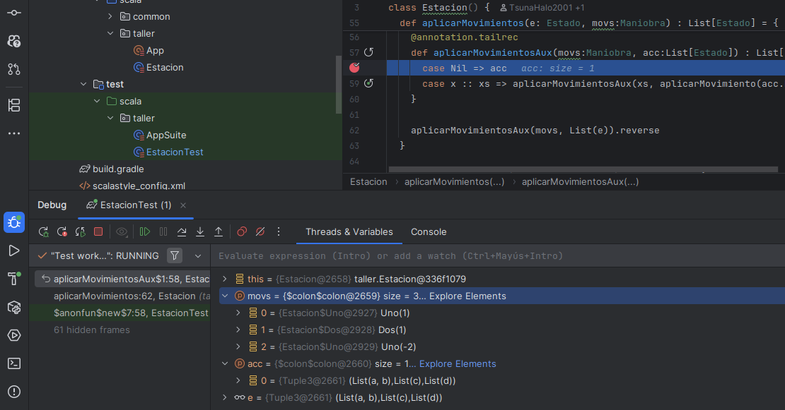
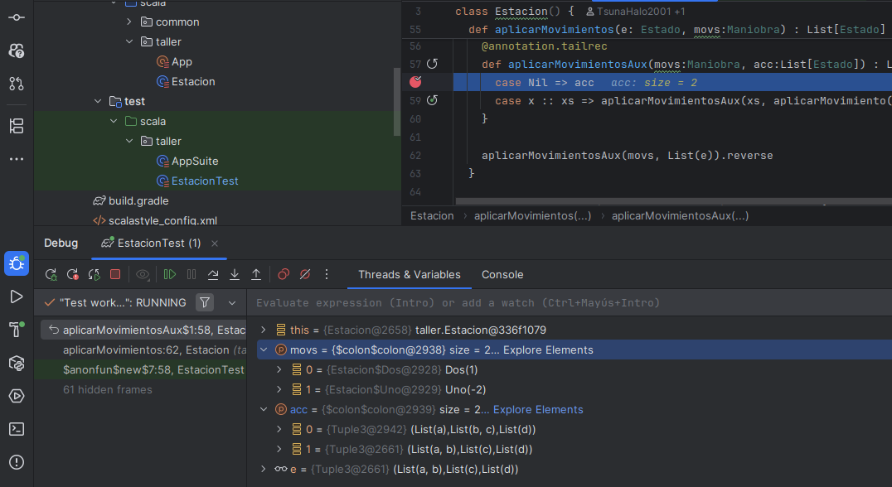
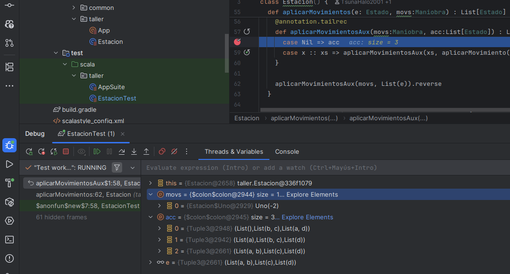
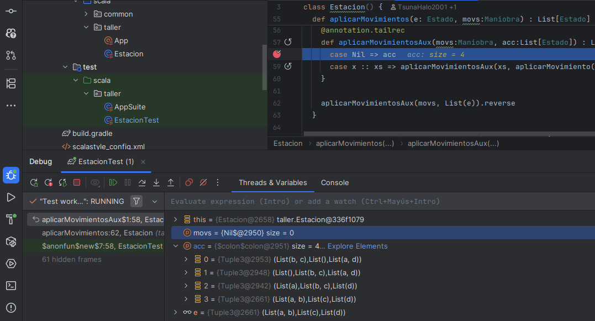

# Informe de procesos de `aplicarMovimientos`

## 1. Descripción del proceso de ejecucion de algoritmo

El algoritmo implementado en la función `aplicarMovimientos` simula una serie de desplazamientos realizados sobre los vagones.

El algoritmo ejecuta `aplicarMovimientos` que llama `aplicarMovimientosAux` en una funcion recursiva para cada movimiento de la lista de movimientos. La función `aplicarMovimiento` se encarga de aplicar un movimiento a un vagón específico, y luego llama a sí misma para aplicar el siguiente movimiento. La función `aplicarMovimientoAux` se encarga de aplicar el movimiento a un vagón específico y luego llama recursivamente a sí misma para aplicar el siguiente movimiento.

## 2. Diseño de funciones recursivas y elementos funcionales

La función `aplicarMovimientosAux` es una función recursiva que toma un vagón y un movimiento como argumentos. La función aplica el movimiento al vagón y luego lo acumula al primer elemento de la lista `acc`

Las funciones usadas en el Test del proceso previo de la funcion `aplicarMovimiento` contienen el mismo funcionamiento de la funcion, permitiendo asi realizar los tsts eficientemente

## 3. Generación de pruebas de software

Se diseñaron pruebas automaticas con tamaños crecientes para evaluar el rendimiento y robustez del algoritmo mediante:

* Pruebas de juguete: 10 vagones
* Prueba pequeña: 100 vagones
* Prueba mediana: 500 vagones
* Prueba grande: 1000 vagones

Para cada prueba:

* Se genera una lista de vagones con un tamaño específico.
* Se generan movimientos aleatorios para cada vagón con la funcion `generarMovimientos`.
* Se evalua el resultado con el resultado dado por `scanLeft` por su funcionamiento similar

* Se mide el tiempo de ejecución de la función `aplicarMovimientos` y se compara con el tiempo de ejecución de `scanLeft`.

## 4. Resultados de las pruebas

### 4.1 Prueba pequeña

Tamaño de la lista: 100
Tiempo de ejecución de `aplicarMovimientos`: 0.001 segundos
Resultado del test: Exitoso

### 4.2 Prueba mediana

Tamaño de la lista: 500
Tiempo de ejecución de `aplicarMovimientos`: 0.009 segundos
Resultado del test: Exitoso

### 4.3 Prueba grande

Tamaño de la lista: 1000
Tiempo de ejecución de `aplicarMovimientos`: 0.024 segundos
Resultado del test: Exitoso

## 5. Conclusiones

El algoritmo `aplicarMovimientos` es eficiente y escalable, capaz de manejar listas de vagones de hasta 1000 elementos en un tiempo razonable. La implementación recursiva permite una fácil comprensión y mantenimiento del código. Las pruebas realizadas demuestran que el algoritmo funciona correctamente y cumple con los requisitos establecidos.
En comparacion al algoritmo `scanLeft`, el algoritmo `aplicarMovimientos` tiene un rendimiento similar, lo que sugiere que la implementación es eficiente y adecuada para su propósito. La función `aplicarMovimientos` es capaz de manejar listas de vagones de hasta 1000 elementos en un tiempo razonable, lo que la convierte en una opción viable para aplicaciones en tiempo real.
Posee complejidad O(n) en el peor de los casos, lo que significa que el tiempo de ejecución del algoritmo aumenta linealmente con el tamaño de la lista de vagones. Esto sugiere que el algoritmo es escalable y puede manejar listas de vagones más grandes sin un aumento significativo en el tiempo de ejecución, comparado con `scanLeft` tiene una parte constante menor.

## 6. Capturas de pila

### Iteracion 1

### Iteracion 2

### Iteracion 3

### Iteracion 4
